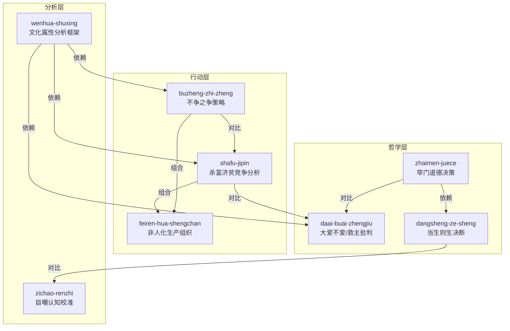

# 遥远的救世主 — Skill 总览

> 本文档是 cangjie-skill 流水线的阶段 3 产出, 建立了全书 8 个 skill 之间的引用关系。

## Skill 清单

| ID | Skill | 类型 | 核心功能 |
|---|---|---|---|
| 1 | wenhua-shuxing | 分析框架 | 用"技术→制度→文化"三层透视法分析问题 |
| 2 | buzheng-zhi-zheng | 竞争策略 | 通过退让让对手内斗, 不争而争 |
| 3 | zhaimen-juece | 道德决策 | 超越外部奖惩, 基于"应当"做判断 |
| 4 | shafu-jipin | 竞争分析 | 评估市场竞争的伦理边界和风险 |
| 5 | feiren-hua-shengchan | 组织设计 | 极端低成本生产的组织方式 |
| 6 | daai-buai-zhengjiu | 援助哲学 | 评估"帮不帮"的悖论框架 |
| 7 | zichao-renzhi | 认知校准 | 自我诊断认知偏差和归因错误 |
| 8 | dangsheng-ze-sheng | 终极决断 | 重大抉择中做出"应当"的决定 |

## 引用关系图

## 依赖关系详情

### 强依赖 (depends-on)
- `buzheng-zhi-zheng` → `wenhua-shuxing`: 不争之争需要先理解文化属性才能判断对手行为模式
- `shafu-jipin` → `wenhua-shuxing`: 杀富济贫需要文化属性框架分析市场生态
- `daai-buai-zhengjiu` → `wenhua-shuxing`: 需要理解弱势文化的形成机制才能判断"救"还是"不救"
- `dangsheng-ze-sheng` → `zhaimen-juece`: 当生则生是窄门在终极抉择中的具体应用

### 对比关系 (contrasts-with)
- `buzheng-zhi-zheng` ↔ `shafu-jipin`: 一个是退让策略，一个是攻击策略
- `zhaimen-juece` ↔ `daai-buai-zhengjiu`: 窄门关注个人道德，大爱不爱关注社会伦理
- `dangsheng-ze-sheng` ↔ `zichao-renzhi`: 一个是向前看的决断，一个是向后看的反思

### 组合关系 (composes-with)
- `buzheng-zhi-zheng` + `feiren-hua-shengchan`: 不争战略 + 低成本组织 = 完整的格律诗模式
- `shafu-jipin` + `feiren-hua-shengchan`: 竞争策略 + 生产能力 = 可执行的竞争优势

## 调用指南

### 新手路线
1. 先用 `wenhua-shuxing` 诊断问题
2. 如果问题涉及竞争 → 用 `buzheng-zhi-zheng` 或 `shafu-jipin`
3. 如果问题涉及组织设计 → 用 `feiren-hua-shengchan`
4. 如果涉及道德选择 → 用 `zhaimen-juece` 或 `daai-buai-zhengjiu`
5. 如果涉及终极抉择 → 用 `dangsheng-ze-sheng`
6. 完成后用 `zichao-renzhi` 反思

### 进阶路线
- 组合 `wenhua-shuxing` + `shafu-jipin` + `feiren-hua-shengchan` = 完整的竞争战略分析
- 组合 `zhaimen-juece` + `dangsheng-ze-sheng` = 道德决断完整流程
- 组合 `wenhua-shuxing` + `daai-buai-zhengjiu` = 扶贫/援助项目评估框架